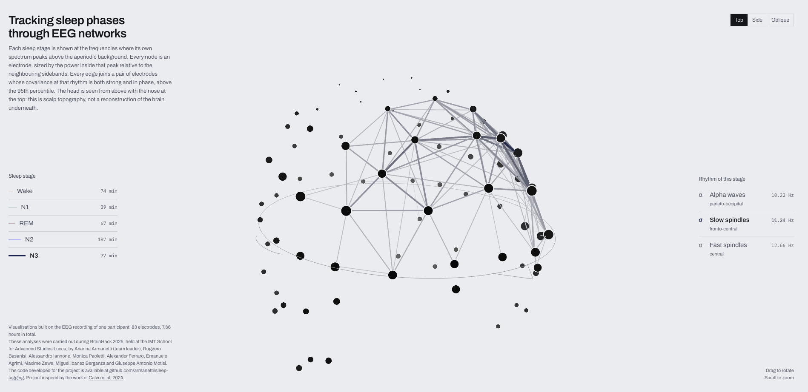
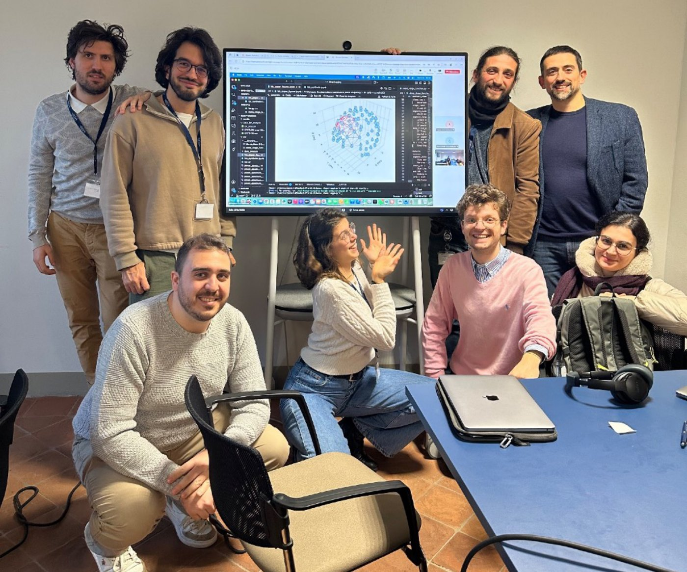

# sleep-tagging

**Frequency-Resolved Functional Connectivity for Sleep Stage Characterization and
Automated Sleep Staging** — BrainHack 2025, IMT School for Advanced Studies Lucca.

Sleep stages have distinctive EEG signatures, and they are still scored by hand,
epoch by epoch, following the standard guidelines. We asked whether those stages
can instead be told apart from the frequency content of the signal, and whether
each of them carries its own connectivity pattern.

The approach we took is the frequency-dependent covariance matrix of
[Calvo et al. 2024](https://arxiv.org/abs/2403.15092). For each stage we compute
the power spectrum of the covariance matrix, find the resonance frequencies where
that stage oscillates above the aperiodic background, and look at how the
electrodes couple at exactly those frequencies. We found a different power
spectrum for every stage, characteristic frequencies appearing as peaks in those
spectra, and connectivity patterns tied to specific scalp areas — which is what
the page below shows.

### [Check out the network of activations during the different sleep stages →](https://armanetti.github.io/sleep-tagging/)

## Data

One overnight polysomnogram from **ANPHY-Sleep**, an open database of 29 healthy
adults recorded with 83 high-density scalp electrodes and scored in 30 s epochs
according to the AASM guidelines: Wei, Avigdor, Ho, Minato, Garcia-Asensi, Royer,
Wang, Travnicek, Schiller, Bernhardt and Frauscher, *ANPHY-Sleep: an Open Sleep
Database from Healthy Adults Using High-Density Scalp Electroencephalogram*,
Scientific Data **11**, 896 (2024),
[10.1038/s41597-024-03722-1](https://doi.org/10.1038/s41597-024-03722-1).

The subject shown on the page is `EPCTL06`, 7.66 hours, resampled to 128 Hz.

## Method

The Time-Lagged Covariance Matrix (TLCM), with $x_i$ the time series of electrode $i$:

$$C_{ij}(\tau) = \int_{-\infty}^{+\infty} dt \, \langle x_i(t) \, x_j(t+\tau) \rangle$$

From it, the Frequency-Dependent Covariance Matrix (FDCM), through the Fourier
transform:

$$S_{ij}(\omega) = \int_{-\infty}^{+\infty} d\tau \, C_{ij}(\tau) \, e^{-i \omega \tau}$$

In practice $S$ is estimated by splitting each stage into chunks of $L$ samples,
taking the Fourier transform of every channel within a chunk and averaging the
outer product over chunks:

$$\hat{s}_n(f) = \frac{1}{L} \sum_{t} x_n(t) \, e^{-2\pi i f t}, \qquad S(f) = \langle \, \hat{s}(f) \, \hat{s}(f)^{\dagger} \, \rangle_{\text{chunks}}$$

The resonances are the peaks of the average diagonal, computed separately for each
sleep phase over the range of natural frequencies of brain activation:

$$\langle S_{ii}(\omega) \rangle = \frac{1}{N} \sum_{i=1}^{N} S_{ii}(\omega)$$

The pipeline is then:

1. **Preprocess** the whole-night EEG recording of each subject: resampling to
   128 Hz, band-pass filtering, average reference, bad-channel detection with
   `pyprep` and ICA to remove cardiac and muscular components.
2. **Select one subject** and compute the power spectrum for each sleep phase.
3. **Find the resonance frequencies**, with the FOOOF algorithm: peaks are taken
   over the aperiodic fit, so they are genuine oscillations and not the $1/f$
   background.
4. **Compute the TLCM at each resonance frequency** and its eigenvalue
   decomposition. Order the electrodes by participation in the first eigenvector
   and plot the thresholded covariance network.

Two details matter for the numbers to be comparable. Every stage is estimated from
the same number of chunks, because the bias of a covariance estimate goes as
$1/\sqrt{n}$ and stages with less data would otherwise look more strongly coupled.
And an edge is drawn when the *real part* of the covariance exceeds the 95th
percentile of its modulus, so only the in-phase half of the strong pairs survives.

## Repository structure

    src/   python scripts and notebooks to analyse the data
    web/   webpage building files

What is inside

    src/fdc.py                      frequency-dependent covariance and the
                                    criticality estimator g(omega)
    src/sleep_stage_function.py     epoch extraction from the hypnogram
    src/data_analysis/              preprocessing: filtering, average reference,
                                    bad-channel detection, ICA
    src/fdc_paper_figures.ipynb     power spectra per stage and eigenvalue
                                    spectra at the peak frequencies
    src/fdc_synthetic.ipynb         validation on coupled Ornstein-Uhlenbeck
                                    processes, where the coupling is known
    src/export_atlas.py             builds web/data_coh/atlas_plates.json
    src/export_timeline_sliding.py  per-epoch connectivity on a sliding window

    web/index.html                  the page, no build step
    web/vendor/                     three.js, vendored so the page has no CDN
                                    dependency
    web/data_coh/                   the JSON the page reads
    web/build_standalone.py         inlines library and data into a single file

    Data_for_analysis/              recordings, not in the repository

Dependencies are pinned in `conda/requirements.txt` — mainly `mne` and `pyprep`
for preprocessing, `numpy` and `scipy` for the covariance, `pandas`, `matplotlib`
and `tqdm`, `fooof` for the spectral parameterisation.

## Reproducing the data

[`src/fdc_paper_figures.ipynb`](src/fdc_paper_figures.ipynb) reproduces the
figures of the presentation: the power spectrum of every sleep stage, the FOOOF
fit that locates the resonances, and the covariance networks at the first two
resonance frequencies.

[`src/export_atlas.py`](src/export_atlas.py) runs the same analysis end to end and
writes the 16 kB JSON the web page reads — electrode positions, per-stage peak
frequencies with their band and scalp region, node power and thresholded edge
list. Put the preprocessed recording, the hypnogram and `ch_pos.csv` in
`Data_for_analysis/`, then:

    cd src
    python export_atlas.py

It takes about 15 seconds. `EDGE_PCT` near the top of the file sets the percentile
above which a pair is drawn.

## The team

Arianna Armanetti (team leader), Ruggero Basanisi, Alessandro Iannone,
Monica Paoletti, Alexander Ferraro, Emanuele Agrimi, Maxim Zewe,
Miguel Ibanez Berganza, Giuseppe Antonio Motisi.

It's been fooon — see you all at the next brainhack :)
